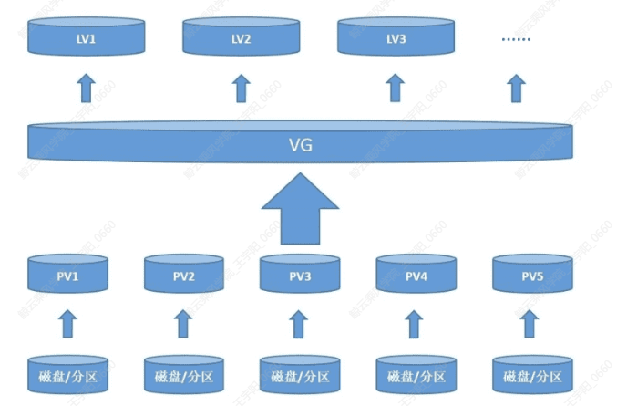

# LVM


​	在进行LVM的学习之前，我们先想一个场景：
​	今天我们在我们的虚拟机上安装了一个Linux的操作系统，这个虚拟机只有一块500G的硬盘。现在我们要规划使用这个硬盘，假设我是使用的MBR的方式，我们会怎么去做?

> /boot分区用于存放引导文件，不能基于LVM创建。

1. 创建1G的主分区一，挂载点/boot，用作启动引导的文件系统。
2. 创建200G的主分区二，挂载点/，用作系统的根目录，存放系统相关的文件。
3. 创建150G的主分区三，挂载点/app1，用作应用1的文件系统。
4. 创建149G的主分区四，挂载点/app2，用作应用2的文件系统。

​	经过这一番操作，我们将虚拟机的硬盘分配完了，可以在系统里面安装我们的应用。

​	经过一年的使用，我们发现/app2文件系统快用完了，并且已经没有数据可以清理了，这时候我们面临着这个文件系统的扩容。那么我们怎么扩容呢?

1. 给虚拟机加一颗新的500G硬盘。
2. 创建一个300G的主分区一，挂载点/app2_new，将/app2中的内容全部复制到/app2_new
3. 取消/app2和/app2_new的挂载，将新的300G的主分区一挂载到/app2。

​	整个过程，相当复杂，还涉及到数据迁移，十分的不方便。正因为这些缺点，LVM应运而生。

## 概念

​	LVM(Logical Volume Management)是Linux下对磁盘分区进行管理的一种工具，适合管理大存储设备，并允许用户动态调整文件系统的大小。

​	LVM可以整合多个实体partition在一起，让这些partitions看起来就像是一个磁盘。而且，还可以在未来新增或移除其他的实体partition到这个LVM管理的磁盘当中。

​	首先我们要理解LVM里面的一些基本元素:

- PV: Physical Volume，物理卷，是LVM最底层的概念，是由分区创建而成VG: Volume Group，物理卷集合，是由PV组成的集合。
- PE: Physical Extent，PV中可以分配的最小存储单元(类似与分区里的Block)。
- LV: Logical Volume，逻辑卷，是在VG集合中重新划分出的元素，可以理解为“逻辑分区”。

​	整个LVM的理念就是将硬件资源聚合之后重组，进行资源的重新分配。可以实现资源的动态调整和控制。



## 相关命令

| pvdisplay | 详细查看PV |
| :-------: | :--------: |
|    pvs    |  简略查看  |
| vgdisplay | 详细查看vg |
|    vgs    |  简略查看  |
| lvdisplay | 详细查看vg |
|    lvs    |  简略查看  |

​	那么我们怎么创建LV呢?很简单，掌握几个命令就行:

- PV创建命令: `pvcreate 分区名称`
- vg创建命令: `vgcreate vG名称 PV名称`
- lv创建命令: `lvcreate -L 大小 -n 名字 VG名称`

​	就拿之前我们说的例子，原先500G的硬盘，我不在划分4个主分区。我只创建一个/boot的主分区，用于操作系统引导启动，剩下的所有空间都划给主分区二。并且把这个主分区二创建为PV，VG；再在VG中创建需要的LV。

```shell
$pvcreate /dev/sda2
$vgcreate vg00 /dev/sda2
$lvcreate -L 200G -n lvroot vg00
$lvcreate -L 150G -n lvapp1 vg00
$lvcreate -L 149G -n lvapp2 vg00
```

​	这时候出现同样的问题，/app2的空间不够怎么办呢?

​	只需要使用LVM的扩容功能就行了。

​	那么我们怎么扩容LV呢?

​	LV扩容命令: `lvextend -l 大小 LV的路径`（这里的大小可以通过带+表示要增加的大小，如果不带+就是需要达到的大小）

​	那LV可以无限制的扩容么?当然不是，从前面的架构里面我们知道，LV只是集合VG中的一个元素，那LV扩容的前提是VG中有剩余空间(vgs或者vgdisplay) 。

​	如果VG没有剩余空间呢?那就需要扩容VG，也就是将PV加入到VG中。

​	VG扩容命令: `vgextend VG PV`

​	还是之前的例子，现在我们加了一块300G的盘，我们怎么给/app2进行扩容呢?

```shell
$pvcreate /dev/sdb(新加的300G的盘)
$vgextend vg00 /dev/sdb
$lvextend -L +151G /dev/vg00/lvapp2 #或者 lvextend -L 300G /dev/vg00/lvapp2
```

​	这时候，我们就完成了LV的扩容。（如果对于正在挂载的在线文件系统，还需要使用在线生效命令，对于xfs文件系统来说是`xfs_growfs /dev/vg00/lvapp2`; ext4是`resize2fs /dev/vg00/lvapp2`)

​	我们看一个Lv创建的过程: (/dev/sda、/dev/sdb、/dev/sdc都有500G大)

```shell
$pvcreate /dev/sda /dev/sdb /dev/sdc
$vgcreate vgdata /dev/sda
$vgextend vgdata /dev/sdb /dev/sdc 
$lvcreate -L 1500G -i 3 -n lvapp vgdata 
$mkfs.xfs /dev/vgdata/lvapp        #格式化文件系统，例如格式化为ext4类型
# mount命令只是临时挂载
$echo -e " /dev/vgdata/lvapp /app defaults xfs 0 0" >> /etc/fstab #挂载文件系统。这样做是永久挂载
$mkdir /app
$mount /app
```

​	注意红色部分，我们创建LV的时候，指定了一个参数-i 3，这个参数是什么意思？条带化创建LV。

​	什么是条带化？简单的说就是将数据用条带的方式平分在不同的PV上。我们不指定条带化参数的时候，条带化默认为1，当我们创建LV后，LV内部进行数据存储时，是串行的使用PV（顺序写)。这样的话，只能使用到一块盘的吞吐性能。如果我们指定条带参数，数据会按照我们的条带设置，拆分后在不同的PV并行写入，这样可以有效提高性能。

## 参考

[LVM与磁盘配额](https://blog.csdn.net/ver_mouth__/article/details/123843823)

[一篇看懂！Linux磁盘的管理（分区、格式化、挂载），LVM逻辑卷，RAID磁盘阵列](https://zhuanlan.zhihu.com/p/296777898)

[使用fdisk进行磁盘分区](https://blog.csdn.net/lyc_258465/article/details/127726607)

[服务器硬件及RAID配置实战](https://blog.csdn.net/ver_mouth__/article/details/123849048)

[引导过程与服务控制](https://blog.csdn.net/ver_mouth__/article/details/123874038)
