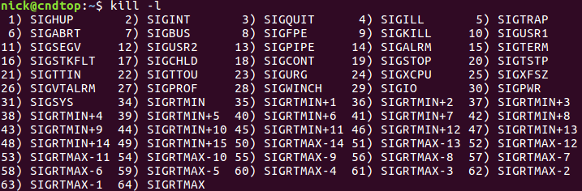

# linux kill 命令

## kill 命令的用途

​	kill 命令很容易让人产生误解，以为它仅仅就是用来杀死进程的。我们来看一下 man page 对它的解释：kill - send a signal to a process.

​	从官方的解释不难看出，kill 是向进程发送信号的命令。当然我们可以向进程发送一个终止运行的信号，此时的 kill 命令才是名至实归。事实上如果我们不给 kill 命令传递信号参数，它默认传递终止进程运行的信号给进程！这是 kill 命令最主要的用法，也是本文要介绍的内容。

​	一般情况下，终止一个前台进程使用 Ctrl + C 就可以了。对于一个后台进程就须用 kill 命令来终止。我们会先使用 ps、top 等命令获得进程的 PID，然后使用 kill 命令来杀掉该进程。

## kill 命令格式

```shell
kill [options] <pid> [...]

<pid> […] : 把信号发送给列出的所有进程。
options :
    -<signal> : 指定发送给进程的信号，指定信号的名称或号码都可以。

    -l : 列出所有信号的名称和号码。
```


## kill 命令详情

### 查看可用信号

​	既然 kill 命令是用来向进程发送信号的，那就让我们先来看看都有哪些信号可以发送给进程。

```shell
$ kill -l
```



​	可不少啊！但这些信号中只有第 9 种信号(SIGKILL)才可以无条件的终止进程，其他信号进程都有权利忽略。并且这么多的信号中常用的也不多，下面我们解释几个常用信号的含义。

| 代号 | 名称    | 内容                                                         |
| ---- | ------- | ------------------------------------------------------------ |
| 1    | SIGHUP  | 启动被终止的程序，可让该进程重新读取自己的配置文件，类似重新启动。 |
| 2    | SIGINT  | 相当于用键盘输入 [ctrl]-c 来中断一个程序的进行。             |
| 9    | SIGKILL | 代表强制中断一个程序的进行，如果该程序进行到一半，那么尚未完成的部分可能会有“半产品”产生，类似 vim会有 .filename.swp 保留下来。 |
| 15   | SIGTERM | 以正常的方式来终止该程序。由于是正常的终止，所以后续的动作会将他完成。不过，如果该程序已经发生问题，就是无法使用正常的方法终止时，输入这个 signal 也是没有用的。 |
| 19   | SIGSTOP | 相当于用键盘输入 [ctrl]-z 来暂停一个程序的进行。             |

​	上表仅是常见的信号，更多的信号信息请自行通过 man 7 signal 了解。一般来说，只要记住 "1, 9, 15" 这三个信号的意义就可以了。

常用命令

```shell
$ kill -15 pid
```

​	这条命令发信号让进程正常退出。所谓的正常退出是指按应用程序自己的退出流程完成退出，这样就可以清理并释放资源。比如 vim 程序，如果是正常的退出，就会删除掉临时文件 *.swp。
​	既然信号 15 是退出进程的正确方式，那它也应该是最常用的方式，因而我们可以省略参数 -15。

```shell
$ kill pid
```

​	这条命令和上面的命令是等价的，kill 命令默认发送信号 15 给目标进程。

​	当进程出现了异常状况，不能通过信号15正常退出时，我们就需要通过非常的手段直接终结掉进程。所谓的非常手段就是传递信号 9 给目标进程！

```shell
$ kill -9 pid
```

​	这样结束掉的进程不会进行资源的清理工作，所以如果你用它来终结掉 vim 的进程，就会发现临时文件 *.swp 没有被删除。

## 总结

​	使用信号 15 是安全的，而信号 9 则是处理异常进程的最后手段，请勿滥用。

