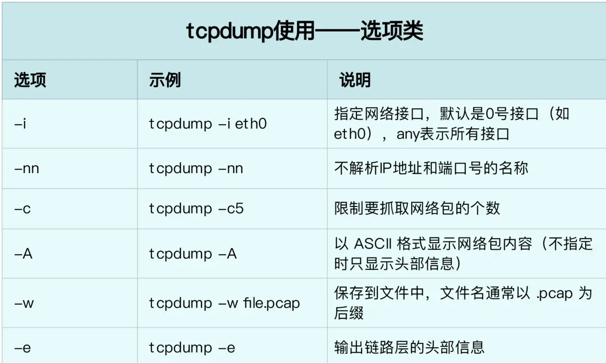
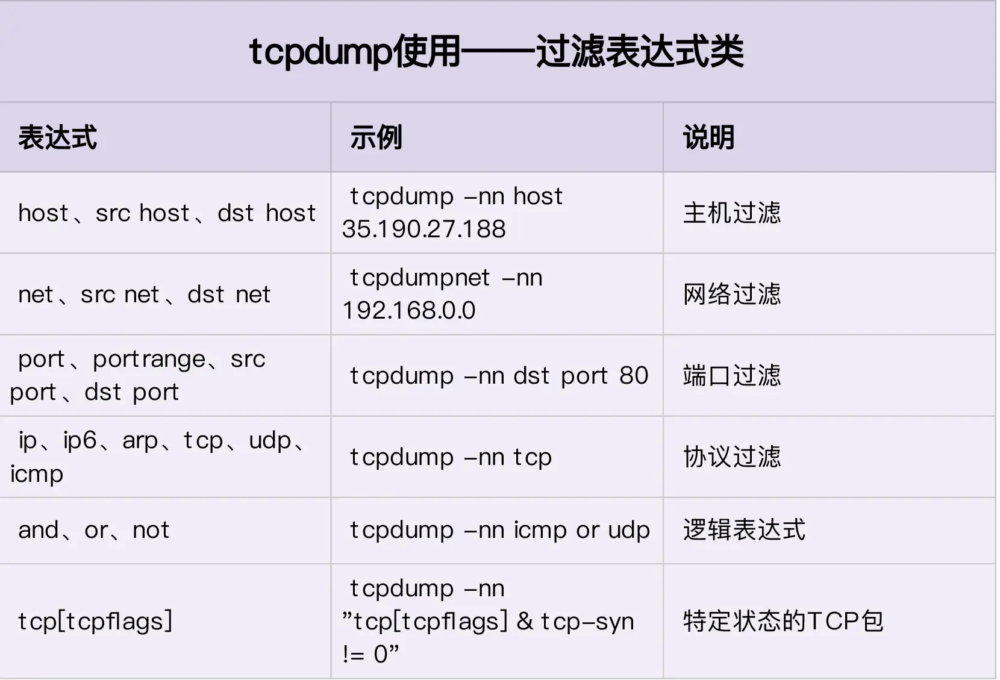

# 网络管理

## 相关命令

| 常用命令                                                     | 作用                                 |
| ------------------------------------------------------------ | ------------------------------------ |
| ifconfig                                                     | 查看⽹络接⼝属性                     |
| ifconfig eth0                                                | 查看某⽹卡的配置                     |
| route -n                                                     | 查看路由表                           |
| netstat -lntp                                                | 查看所有监听端⼝                     |
| netstat -antp                                                | 查看已经建⽴的TCP连接                |
| netstat -lutp                                                | 查看TCP/UDP的状态信息                |
| ifup eth0                                                    | 只启⽤eth0⽹络设备                   |
| ifdown eth0                                                  | 只禁⽤eth0⽹络设备                   |
| iptables -L                                                  | 查看iptables规则                     |
| ifconfig eth0 192.168.1.1 netmask 255.255.255.0              | 配置ip地址                           |
| dhclient eth0                                                | 以dhcp模式启⽤eth0                   |
| route add -net 0/0 gw Gateway_IP                             | 配置默认⽹关                         |
| route add -net 192.168.0.0 netmask 255.255.0.0 gw 192.168.1.1 | 配置静态路由到达⽹络'192.168.0.0/16' |
| route del 0/0 gw Gateway_IP                                  | 删除静态路由                         |
| hostname                                                     | 查看主机名                           |
| host [www.baidu.com](http://www.baidu.com)                   | 解析主机名                           |
| nslookup [www.baidu.com](http://www.baidu.com)               | 查询DNS记录，查看域名解析是否正常    |


## 网络状态查看

​	net_tools VS  iproute

### ifconfig

​	可以查看到自己网卡的名称，为了方便我们可以将其修改为初始名eth0。网卡命名规则受biosdevname和net.ifname两个参数影响，编辑/etc/default/grub文件，修改完成后使用`update-grub`命令使其生效，再重启即可。


## 查看网管命令

​	 `route -n`查看当前系统的路由表

​	Web服务器的目标地址首先会和第一条目的子网掩码（Genmask）进行与运算，得到的结果会与Destination值进行比较。不匹配则会对比下一条。

## 网络故障排除命令

### ping

### traceroute

### mtr

### nslookup

​	域名解析获得IP地址

### telnet

​	如`telnet www.baidu.com 80`查看服务器上端口是否可达。

### tcpdump



​	接下来，我们再来看常用的过滤表达式。

​	我们使用 `tcpdump -nn udp port 53 or host 35.190.27.188`，表示抓取 DNS 协议的请求和响应包，以及源地址或目的地址为 35.190.27.188 的包。

​	`tcpdump -i any -n port 80 and host 10.0.0.1 -w /tmp/file`

​	其他常用的过滤选项，我也整理成了下面这个表格。



Linux Web服务器网站故障分析常用的命令

- 想要截获所有210.27.48.1的主机收到的和发出的所有的数据包


```shell
tcpdump host 210.27.48.1
```

- 想要截获主机210.27.48.1和主机210.27.48.2或210.27.48.3的通信，使用命令：

```shell
tcpdump host 210.27.48.1 and \（210.27.48.2 or 210.27.48.3 \）
```

- 想如果想要获取主机210.27.48.1除了和主机210.27.48.2之外所有主机通信的ip包，使用命令：

```shell
tcpdump ip host 210.27.48.1 and ! 210.27.48.2
```

- 如果想要获取主机210.27.48.1接收或发出的telnet包，使用如下命令：

```shell
tcpdump tcp port 23 host 210.27.48.1
```

- 对本机的UDP123 端口进行监视123为ntp的服务端口

```
tcpdump udp port 123 
```

- 系统将只对名为hostname的主机的通信数据包进行监视。主机名可本机或他机。

```shell
tcpdump -i eth0 src host hostname
```

- 下面的命令可以监视所有送到主机hostname的数据包

```shell
tcpdump -i eth0 dst host hostname
```

- 我们还可以监视通过指定的网关的数据包

```shell
tcpdump -i eth0 gateway gatewayname
```

- 如果想要获取主机192.168.228.246接收或发出的ssh包，并且不转换主机名使用如下命令：

```shell
tcpdump -nn -n src host 192.168.228.246 and port 22 and tcp
```

- 获取主机192.168.228.246接收或发出的ssh包，并把mac地址也一同显示：

```shell
tcpdump -e src host 192.168.228.246 and port 22 and tcp -n -nn
```

- 过滤的是源主机为192.168.0.1与目的网络为192.168.0.0的报头：

```shell
tcpdump src host 192.168.0.1 and dst net 192.168.0.0/24
```

- 过滤源主机物理地址为XXX的报头：

```shell
tcpdump ether src 00:50:04:BA:9B and dst……
```

- 过滤源主机192.168.0.1和目的端口不是telnet的报头，并导入到tes.t.txt文件中：

```shell
tcpdump src host 192.168.0.1 and dst port not telnet -l > test.txt
```


### netstat

```shell
netstat -lntp #查看tcp端口占用情况
```


### ss

​	作用与netstat一样，只是显示出来的格式不同，会显示进程号。


## network和networkmanager两套工具配置网络


