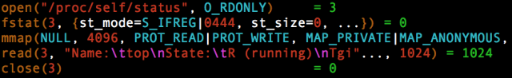

# Linux top命令的数据从哪儿来？

​	`top`命令是linux下非常重要的命令，帮助我们快速查看系统状态。

​	那么top是如何获取系统各项状态指标的呢？

​	我们用`strace`命令跟踪一下top的执行

```shell
$ strace -o /tmp/strace_top.txt top -b -n 1
```

​	**`strace`的作用**：

​	Linux中，进程不能直接访问硬件设备，当进程需要访问硬件设备(比如读取磁盘文件，接收网络数据等等)时，必须由用户态模式切换至内核态模式，通过系统调用访问硬件设备。strace可以跟踪到一个进程产生的系统调用。上面的命令中，把top的执行情况保存到了文件中。我们可以查看文件内容：

```shell
$ vim /tmp/strace_top.txt
```

 

​	文件内容非常多，也比较复杂，但可以看到一个规律，就是对非常多的文件执行打开、读取、分析、关闭的动作，例如



​	并且在读取的文件中，涉及 **/proc** 目录下的文件非常多。**/proc** 本身是一个虚拟文件系统，并非存在于硬盘之中，而是由Linux内核凭空创建，保存在内存中。/proc 的**目录结构**为

```
/proc
|--/version
|--/fs 
|--/stat 
|--......
|--/N/stat
|--/N/mem
|--/N/fs
|--/N/......
```

​	**/proc** 下的文件是系统的相关信息

​	**/proc/N** N是以进程号为名字的目录，其中是此进程的相关信息文件

​	如/proc/2000，2000为PID，Linux 内核将与之关联的信息打印到此目录相关文件中

​	所以/proc目录的文件就是 `top` 的重要消息来源

**例如**

/proc/cpuinfo 

​	cpu的硬件信息，如型号、速率、核数、cache大小……

/proc/meminfo

​	内存的信息，如内存总量、free空间、swap空间……

/proc/stat

​	所有的CPU活动状态的信息

/proc/diskstats 

​	磁盘信息

/proc/loadavg 

​	根据过去一段时间内CPU和IO的状态得出的负载状态

/proc/N/fd 

​	进程相关的所有的文件描述符

/proc/N/mem 

​	进程持有的内存，不可读

/proc/N/stat 

​	进程的状态，内容可读性差，但其中包含了很多重要的信息，如：该任务在用户态运行的时间、该任务在核心态运行的时间、当前驻留物理地址空间的大小、虚拟地址空间大小、父进程ID、线程组号...

/proc 中包含了丰富的系统信息，是各种监控命令和工具的重要数据来源。
