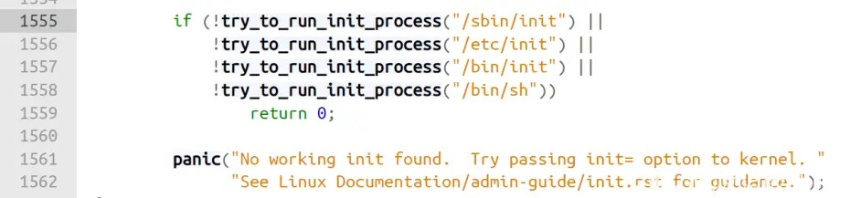

# Linux的第一个进程

​	操作系统被引导程序拉起后，会加载第一个进程，一般为 init 进程，然后操作系统把控制权交给 init 进程，其他进程都是 init 进程的子进程。

## 如何查看第一个进程

​	Linux 中有许多的命令行工具，对于查看进程树可以使用`pstree`命令，下面是我在 WSL 中使用 `pstree`命令打印出的结果。

```shell
init─┬─init───init─┬─adb───2*[{adb}]
     │             ├─bash───pstree
     │             └─pager
     └─2*[{init}]
```

​	可以看到，进程树的根节点是 init 进程，如果想要查看进程的进程号，可以使用 top 命令，可以看到 init 进程的进程号 PID 为 1，也就是 1 号进程。

## init 是 systemd 吗

​	有时也会在别的地方看到 systemd 是系统的第一个进程，其实和 init 是一个东西。

​	init 是第一个进程，但是是一个软链接，在我的 WSL 中可以看到 init 是一个指向 systemd 的软链接。

```shell
init -> /lib/systemd/systemd
```

## 源码层面查看第一个进程

​	现在 Linux 内核最新版为 v5.18.3，源码可以通过 bootlin 网站查看。

​	init 程序的代码位置在 /init/main.c 中的第 1555 行到 1562 行，如下图所示。



## init 程序的查找顺序

​	可以看到操作系统启动第一个进程会有查找顺序，查找顺序为 /sbin/init、/etc/init、/bin/init、/bin/sh，如果前面的没有找到，那么就会查找下一个文件。

​	如果都没有找到，那么程序会 return 0 值，然后 panic 提示一个错误信息：没有找到 init，可以给内核传递 init= 选项来指定 init 程序。

## 小结

​	操作系统被引导程序拉起后，会加载第一个进程，第一个进程可以通过 pstree 输出进程树查看，一般为 /sbin/init 程序，软链接指向 systemd。Linux 有一个查找第一个进程的顺序，也可以自己指定 init 程序。

